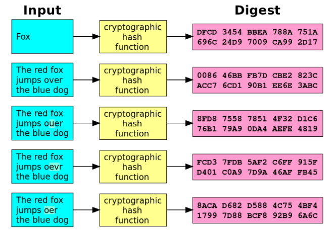
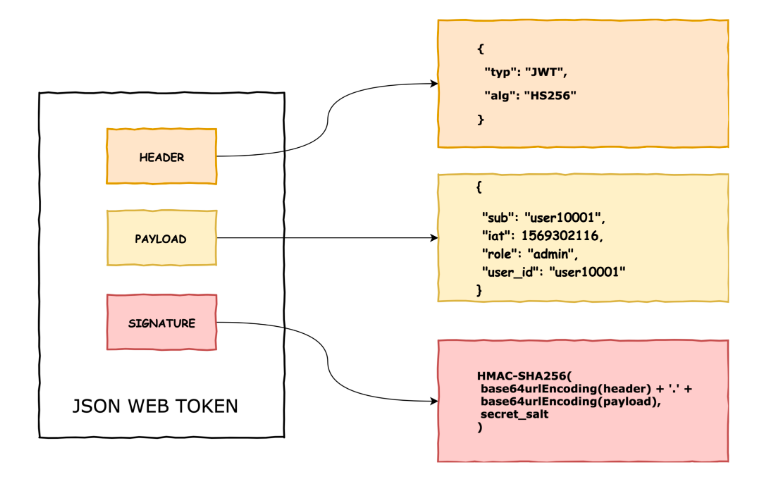

## Brief

### Preparation

Install bcrypt and jsonwebtoken via npm: `npm install bcrypt jsonwebtoken`.

### Lesson Overview

In this lesson, there will not be a fixed entry file, typically ./index.js. 

Instead, the codes will be run in multiple files with node command directly. Parameters will be added in the terminal command (ex. `node index.js param1 param2`). This approach will be used to pass in arguments into a JS file.

The `index.js` file contains a sample of how to get the data from the terminal.

---

## Part 1 - Security

Security is a vital part of any system. In today's technology trend, information has become another resource for people to exploit, hence, information security is essential.

Information security is a group of practices designed to maintain personal data secure from unauthorized access and changes.

There are three pillars of information security namely: 
- Confidentiality
- Integrity 
- Availability

There are many ways to provide security to our applications. For this lesson, the focus will be on hashing and json web token, two technologies that are commonly used for user authentication.

## Part 2 - Hashing

Hashing is for validating the integrity of content by detecting modifications via changes in the hash output.



Hashing is important to add security (eg. passwords) to the information stored in databases.

*Question: Why do you think passwords should be hashed before storing them into a database?*

### Creating hashed values

```js
//hash.js
const bcrypt = require('bcrypt'); 
const saltRounds = 10; 
const plainText = process.argv[2]; // Taken from command

bcrypt.hash(plainText, saltRounds, function(err, hash){
    
    // A callback function called after hash() completes.    
    if(err){
        console.error(err);
        return;
    }
    console.log(hash);
});
```

*Question: how many salt rounds is necessary?*

Try running the file and providing an argument after the file (eg.`node hash.js banana`).

A encoded string should appear after hashing:

`$2b$10$6QaGmjM6lSAs1XUx8.cUiOa1fM4TNInfHrw3sFkIOLapp6M8y62Ay`

### Verifying hashed values

To verify hashes, the original string and the hashed string will be compared using bcrypt's `compare` function.

```js
//verify-hash.js
const bcrypt = require('bcrypt');
const hashedValue = process.argv[2];
const plainText = process.argv[3];

bcrypt.compare(plainText, hashedValue, function(err, result){
    console.log(`compare ${plainText} against ${hashedValue}`);
    if(err){
        console.error(err);
        return;
    }

    console.log(result);
});
```

Run the following commands to see the difference of how strings are being compared:

```
node verify-hash.js '$2b$10$6QaGmjM6lSAs1XUx8.cUiOa1fM4TNInfHrw3sFkIOLapp6M8y62Ay' banana

node verify-hash.js '$2b$10$6QaGmjM6lSAs1XUx8.cUiOa1fM4TNInfHrw3sFkIOLapp6M8y62Ay' apple
```

Based on the above execution, note that the hashed value compared against "apple" returns false while it returns true when compared against "banana".

---

## Part 3 - JSON Web Token

JSON Web Token (JWT) is an open standard that defines a compact and self-contained way for securely transmitting information between parties as a JSON object. 

This information can be verified and trusted because it is digitally signed.

JWT is typically used for the following:
- Authentication: Once the user is logged in, each subsequent request will include the JWT, allowing the user to access routes, services, and resources that are permitted with that token.
- Information Exchange: JSON Web Tokens are a good way of securely transmitting information between parties. Because JWTs can be signed using public/private key pairs or secrets, you can be sure the senders are who they say they are.

### Generating JWT Tokens

Tokens can be created using the `sign` method. It needs the payload (or data to be sent) and either the secret or a public/private key to sign the payload with. Other options such as expiry can also be provided as needed for more security.

```js
//generate-jwt.js
const jwt = require("jsonwebtoken"); // Import
const secret = "This is our secret";

// The data to be used for generating JWT
const mockLoginData = {
    accountId: 1,
    email:"brandon@mail.com",
    permissions:{
        role:"ADMIN",
    }
}

// Generate token with the above data. 
const token = jwt.sign(mockLoginData, secret, {expiresIn:"1d"});
console.log(token);
```

The result is a token that contains encrypted information (header, information, and signature).



Try executing the code using `node generate-jwt.js` and notice the outuput.

### Verifying JWT

JWT can be verified using the `verify` function and data can be pulled after it has been verified.

```js
//verify-jwt.js
const jwt = require("jsonwebtoken"); // Import
const secret = "This is our secret";
const token = process.argv[2]; // Input argument

// Decrypt the given token
jwt.verify(token, secret, function(err, decoded){
    if(err){
        console.error(err);
        return;
    }
    console.log(decoded); 
});
```

Additional reading: A set of private and public key can be used instead of using secrets. To generate a private key, you can access https://cryptotools.net/rsagen to do so.

---
